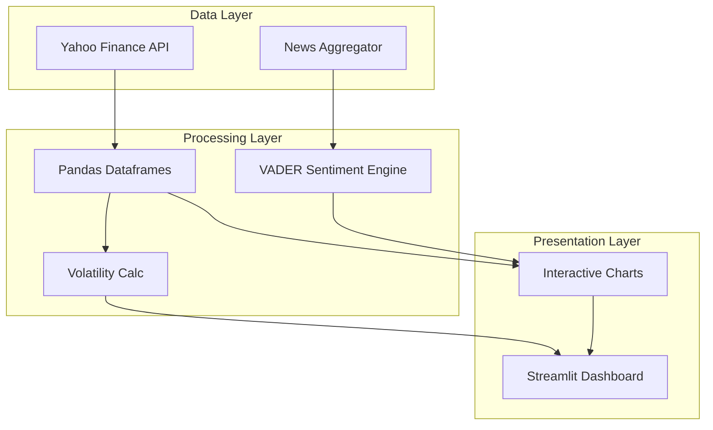

# Stock Intelligence Flux

[](https://elliottfairhall-stock-analysis-tool-main-pgogm7.streamlit.app/)
[](https://www.python.org/downloads/)
[](https://opensource.org/licenses/MIT)
[](https://github.com/astral-sh/ruff)

A comprehensive financial analytics platform that combines real-time market data with sentiment intelligence. This tool
aggregates quantitative metrics and qualitative news signals to provide a holistic view of market assets.


## Features

- **Multi-Asset Analysis**: Compare performance across major tech and industrial tickers (AAPL, TSLA, MSFT, etc.)
- **Volatility Engine**: Real-time risk assessment using historical price variance
- **Sentiment Flux**: Integrated NLP engine (VADER) to score breaking news and media coverage
- **Relative Returns**: Benchmarking asset performance against peer groups
- **Premium UI**: Dark-mode optimized interface with interactive Plotly visualizations

## Architecture



## Project Structure

```
Stock-Analysis-Tool/
├── app.py                  # Main application entry point
├── src/
│   ├── analysis.py         # Financial and sentiment logic
│   ├── charts.py           # Plotly visualization configurations
│   └── data.py             # API connections (Yahoo Finance)
├── assets/                 # Static assets
├── styles/                 # Custom CSS styling
├── pyproject.toml          # Project configuration
├── requirements.txt        # Dependencies
└── README.md
```

## Requirements

- Python 3.10 or higher
- Streamlit >= 1.32.0
- yfinance >= 0.2.0
- VADER Sentiment >= 3.3.0
- Plotly >= 5.18.0

## Installation

1. Clone the repository:

   ```bash
   git clone https://github.com/elliottfairhall/Stock-Analysis-Tool.git
   cd Stock-Analysis-Tool
   ```

2. Create a virtual environment:

   ```bash
   python -m venv venv
   source venv/bin/activate  # On Windows: venv\Scripts\activate
   ```

3. Install dependencies:

   ```bash
   pip install -r requirements.txt
   ```

4. (Optional) Configure environment variables:

   ```bash
   cp .env.example .env
   # Edit .env and add any API keys if needed
   ```

5. (Optional) Run diagnostic tests:

   ```bash
   python test_yfinance.py
   ```

## Usage

1. Start the application:

   ```bash
   streamlit run app.py
   ```

2. Open your browser at `http://localhost:8501`.

3. Use the **Data Engine** sidebar to:

   - Select multiple assets for comparison (e.g., MSFT, TSLA, AAPL).
   - View real-time price updates and deltas.

4. Navigate tabs to explore:

   - **Project Overview**: Methodology and strategic context.
   - **Market Dynamics**: Price history, volatility, and returns.
   - **Sentiment Intelligence**: AI-scored news relevance and sentiment polarity.

## Troubleshooting

If you encounter data fetching errors:

1. Run the diagnostic script: `python test_yfinance.py`
2. Check internet connectivity
3. Verify ticker symbols are correct
4. Review detailed error messages in the app
5. See `IMPROVEMENTS.md` for comprehensive troubleshooting guide

## Business Use Case

This tool demonstrates advanced capabilities for functional financial technology:

- **Quantitative Analysis**: Automating the calculation of key risk metrics (volatility, beta).
- **Alternative Data**: Leveraging unstructured text data (news) to generate trading signals.
- **Comparables Analysis**: Rapidly benchmarking assets against industry peers.

## License

This project is licensed under the MIT License - see the [LICENSE](LICENSE) file for details.

## Author

**Elliott Fairhall**

- Website: [data-flakes.dev](https://data-flakes.dev)
- GitHub: [@elliottfairhall](https://github.com/elliottfairhall)
- LinkedIn: [Elliott Fairhall](https://uk.linkedin.com/in/elliott-fairhall-666945105)
